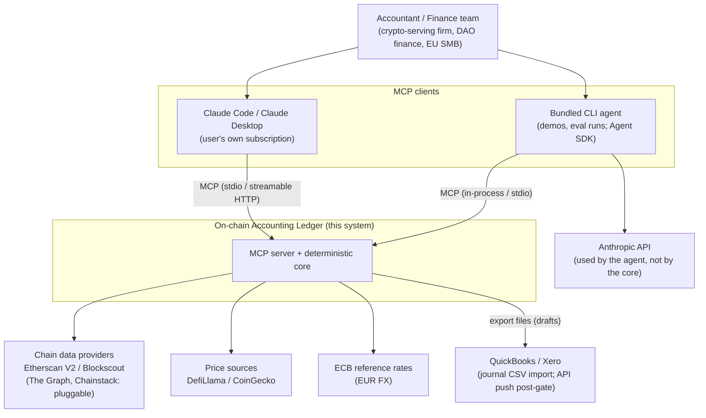
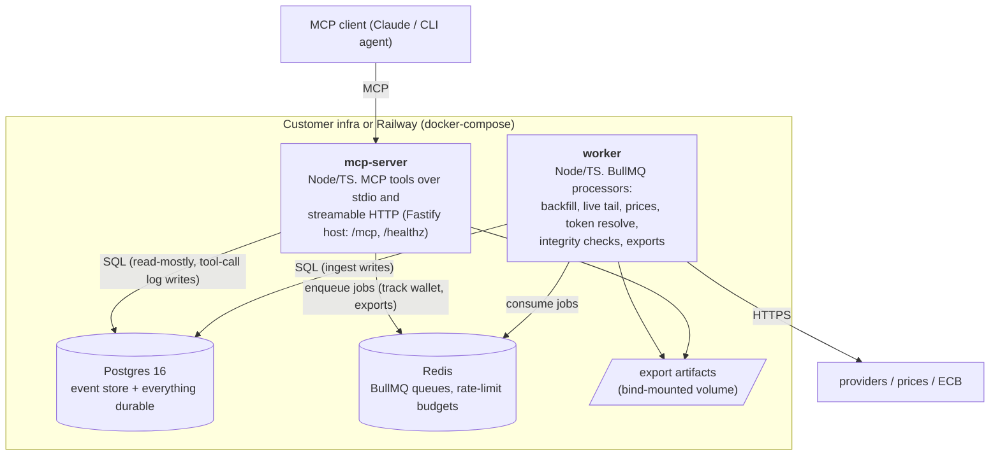

# Architecture Overview

C4 levels 1–2 (rendered as mermaid flowcharts), bounded contexts, monorepo layout, and
deployment views. Scope and constraints: see [`../brief.md`](../brief.md).

## 1. System context (C4 level 1)



Two boundaries matter:

- **LLM boundary.** The LLM lives entirely on the client side (Claude app or the bundled CLI
  agent). The core never calls an LLM and never trusts LLM output: tools compute
  deterministically (P1) and return citation envelopes (P2). The Anthropic API key is only
  needed by the CLI agent and the eval harness — never by the server or worker.
- **Self-host boundary.** Everything inside "this system" plus Postgres/Redis runs on the
  customer's infrastructure under docker-compose. Outbound traffic is limited to chain data
  and price providers (public data). This is the GDPR sales argument (P10).

## 2. Containers (C4 level 2)



Notes:

- `mcp-server` and `worker` are **two commands over one image** (same codebase, different
  entrypoint) — one Dockerfile, no duplicated builds.
- The server does not ingest; the worker does not serve. All provider I/O, rate limiting,
  and retries live in the worker. The server reads the ledger and enqueues jobs.
- The web dashboard (Nuxt) is deliberately absent — post-gate (P11).

## 3. Bounded contexts

| Context | Responsibility | Owns tables | Package |
|---|---|---|---|
| **Ingestion** | Providers → normalized events; checkpoints; finality; backfill/live; integrity checks | `chain_events` (writes), `ingestion_checkpoints`, `tokens` (discovery) | `packages/ingestion` |
| **Ledger** | Deterministic computation over events: balances, flows, gas, counterparty turnover | reads `chain_events`, `tokens` | `packages/ledger` |
| **Pricing** | Daily price snapshots, ECB FX; valuation with pinned snapshot IDs | `price_snapshots`, `fx_rates` | `packages/pricing` |
| **Directory** | Address book: entities, labels, curated global labels | `entities`, `entity_addresses` | `packages/db` (thin; logic in tools) |
| **Reconciliation** | External records (invoices…), deterministic matching, match lifecycle (HITL) | `external_records`, `matches` | `packages/recon` |
| **Export** | Close pack CSVs, PDF summary, QBO/Xero journal drafts, audit manifests | `exports` | `packages/exporters` |
| **Interface** | MCP tools: citation envelope, sanitization, tenancy scoping, tool-call log | `tool_calls`, `api_keys` | `packages/mcp-tools`, `apps/mcp-server` |
| **Tenancy** | Tenants, clients (firm's sub-clients), wallets, credentials | `tenants`, `clients`, `wallets`, `integration_credentials` | `packages/db` |

Dependency direction (enforced with dependency-cruiser):

```
apps/*  →  mcp-tools  →  { ledger, recon, exporters, pricing }  →  db  →  core
                 ingestion  →  db, core          (worker-only)
core imports nothing internal. Nothing imports apps.
```

`packages/core` is the shared kernel: domain types, Zod schemas, money math
(bigint/decimal, branded types), chain config registry, the sanitizer, and a structured stdout logger. It has no network, database, or filesystem I/O.

## 4. Monorepo layout

pnpm workspaces + Turborepo (ADR-001).

```
pet_crypto/
├── apps/
│   ├── mcp-server/        # stdio entry + Fastify host for streamable HTTP (/mcp, /healthz)
│   ├── worker/            # BullMQ processors (ingestion, prices, exports, integrity)
│   └── cli/               # thin agent (Agent SDK): demo REPL + `evals run`
├── packages/
│   ├── core/              # domain types, zod schemas, Money, sanitizer, chains config
│   ├── db/                # drizzle schema, SQL migrations, tenant-scoped repositories
│   ├── ingestion/         # ChainDataProvider adapters, normalizer, checkpoint state machine
│   ├── pricing/           # DefiLlama/CoinGecko/ECB adapters, snapshot service
│   ├── ledger/            # deterministic aggregations (pure functions + SQL builders)
│   ├── recon/             # matching engine, match lifecycle, status derivation
│   ├── exporters/         # close pack, PDF summary, QBO/Xero journal CSV, manifests
│   ├── mcp-tools/         # tool implementations: envelope, citations, scoping, annotations
│   └── evals/             # fixtures (golden wallets, recorded provider responses), datasets, graders
├── docs/                  # this documentation + ADRs
├── docker-compose.yml     # postgres, redis, mcp-server, worker
└── turbo.json, pnpm-workspace.yaml, tsconfig.base.json
```

Why `mcp-tools` is a package and not part of the server: the CLI agent and the eval harness
call tools **in-process** (no transport, no server lifecycle) — evals become fast and
deterministic, and the MCP server stays a thin adapter that registers the same tool objects
against the official SDK.

## 5. Deployment views

**Self-host (first-class, P10):**

```yaml
# docker-compose.yml (illustrative sketch)
services:
  postgres:  { image: postgres:16, volumes: [pgdata:/var/lib/postgresql/data] }
  redis:     { image: redis:7 }
  mcp-server:
    build: .
    command: node apps/mcp-server/dist/http.js   # streamable HTTP on :8484
    env_file: .env                               # provider keys, MASTER_KEY, DATABASE_URL
  worker:
    build: .
    command: node apps/worker/dist/main.js
volumes: { pgdata: {}, exports: {} }
```

stdio mode for Claude Desktop/Code runs the same image:
`docker compose run --rm mcp-server node apps/mcp-server/dist/stdio.js` (or a local
`node` invocation during development). Transport & auth details: ADR-012.

**Hosted demo:** the same two services + managed Postgres/Redis on Railway; streamable HTTP
with per-tenant bearer keys. Compose remains the source of truth; Railway config mirrors it.

## 6. Roadmap → architecture mapping

| Weeks | Built | Definition of done |
|---|---|---|
| 1–3 | `core`, `db`, `ingestion`, `pricing`, `ledger`, worker | Golden fixtures ingest deterministically on both chains (Base enabled by config only); property tests green; balances match provider spot-checks (integrity job). |
| 4–5 | `mcp-tools`, `apps/mcp-server`, `apps/cli`, `evals`, Face A exports | Eval gate met (04-testing.md §6): citations/guardrails 100%, numeric ≥90%. OSS repo + video published. |
| 6–8 | `recon`, `exporters` (journal drafts), recon tools | Invoice CSV → suggested matches → confirm → balanced QBO/Xero journal draft, on fixtures and one real wallet. |
| 9–12 | Nothing new (validation) | Interviews use the working demo; only bug fixes and eval additions. |

## 7. Key mechanisms (pointers)

- Money representation and rounding: `01-data-model.md` §2, ADR-004.
- Event conventions (`log_index` sentinels, gas-as-event): `01-data-model.md` §3, ADR-005.
- Citation envelope contract: `02-mcp-contracts.md` §2, ADR-012.
- Ingestion state machine, finality, backfill: `03-ingestion.md`, ADR-008/009.
- Matching engine: `01-data-model.md` §6, ADR-010.
- Sanitization of hostile strings: `02-mcp-contracts.md` §7, ADR-011.
- Test & eval strategy: `04-testing.md`.
