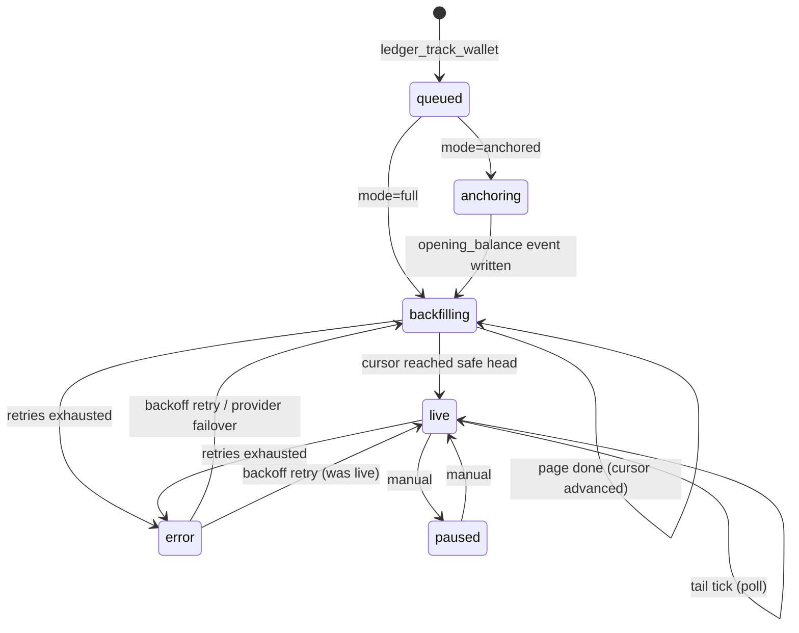

# Ingestion Pipeline

Providers → normalized events, idempotently (P4), with reorg safety by finality lag and
config-driven chains (Option C seam #2). Related ADRs: 005 (event store), 008 (queues &
backfill), 009 (provider abstraction).

## 1. State machine

One state row per `(chain_id, address, stream)` — persisted in `ingestion_checkpoints`
(the DB row *is* the state; workers are stateless and crash-safe).



Streams are independent: `native` (provider tx list) and `erc20` (provider transfer
list) are different endpoints with different pagination, so each has its own cursor.
A wallet is "live" when **all** its streams are live; `ledger_status` reports per-stream.

## 2. Queue topology (BullMQ, ADR-008)

| Queue | Producer | Job unit | Priority | Concurrency |
|---|---|---|---|---|
| `tail` | scheduler (repeatable per chain) | one tick: all live checkpoints of a chain | high | 1 per chain |
| `backfill` | `ledger_track_wallet`, retry logic | one page window per (chain, address, stream) | low | shared pool, provider-limited |
| `prices` | scheduler (daily cron) + on-demand gaps | snapshot day × token set; ECB fetch | mid | 1 |
| `token-resolve` | normalizer (unseen contract) | one token contract | mid | provider-limited |
| `integrity` | scheduler (daily) + on-demand | one wallet spot-check | low | 1 |
| `exports` | export tools | one export artifact | mid | 1 |

Rules:

- **Live beats backfill.** Tail ticks must never starve behind a whale backfill:
  separate queues, higher priority, and a reserved worker slot for `tail`.
- Retries: exponential backoff (1 min → 1 h cap), 8 attempts, then the checkpoint goes
  `error` (+ `last_error`) and the job lands in the DLQ. `ledger_status` surfaces it —
  errors are user-visible, never swallowed.
- Scheduling is repeatable-job based (BullMQ repeatables), not OS cron — one less
  moving part in compose.

## 3. Backfill algorithm

For each `(chain, address, stream)`, ascending block order:

```
cursor = checkpoint.last_processed_block          // 0 or anchor_block initially
safe   = safeHead(chain)                          // head - finality_depth
loop:
  page = provider.getPage(address, from=cursor+1, to=safe, limit=1000, sort=asc)
  events = normalize(page)                        // pure function, packages/ingestion
  tx {                                            // single Postgres transaction
    INSERT ... ON CONFLICT (chain_id, tx_hash, log_index, token_id) DO NOTHING
    UPDATE ingestion_checkpoints SET last_processed_block = newCursor
  }
  enqueue token-resolve for unseen contracts
  if page.length < limit: status = live; break
  // page full: a block's events may be split across pages ->
  // newCursor = last item's block_number - 1; the overlap re-fetches that block
  // and the idempotency key dedupes. Correctness needs no provider ordering
  // guarantees beyond block-level sort.
```

The **transactional cursor advance** is the crash-safety core: a worker killed mid-page
re-runs the page; `ON CONFLICT DO NOTHING` makes the re-run free. Idempotency is not a
recovery mode — it is the only mode (P4).

**Anchored mode** (whales, ADR-008): `anchoring` fetches the provider-attested balances at
`anchor_block` (`getNativeBalanceAt` / `getErc20BalanceAt` capability), writes one
`opening_balance` event per token (synthetic `tx_hash = 'anchor:<addr>:<block>'`,
`log_index = -3`), sets `checkpoint.anchor_block`, and backfill proceeds from there.
All downstream coverage carries `anchor_block`, and every tool answer over it emits
`ANCHORED_BASELINE` (C5) — the trade-off is visible to the accountant, by contract.
Token set for the anchor: provider's token-balance listing at anchor time ∪ curated
verified list; discrepancies show up in integrity checks.

## 4. Finality & reorgs (P4)

No rollback machinery. Ingestion never advances past
`safeHead = head − finality_depth(chain)`, so every stored event is final by
construction — the entire reorg problem is reduced to one config number per chain:

| Chain | `finality_depth` (default) | Lag at default | Rationale |
|---|---|---|---|
| Ethereum (1) | 64 blocks | ~13 min | ≈ 2 epochs ≈ consensus finality |
| Base (8453) | 600 blocks | ~20 min | OP-stack: covers L1-reorg-induced resequencing pragmatically |

Accounting tolerates minutes of lag; trading would not, and this system is not for
trading. The knob is per-chain config; lowering it trades immutability guarantees for
freshness and is documented as unsupported for accounting use.

Safety net: the **integrity job** (daily + on-demand per wallet) recomputes native + top
token balances from events at the checkpoint block and compares with the provider's
balance-at-block. Drift ⇒ `last_integrity.clean = false`, surfaced in `ledger_status` and
as a tool warning. Known systematic drift sources it will catch: missed internal
(trace-level) ETH transfers — an explicit MVP gap (see `05-risks-open-questions.md`).

## 5. Provider abstraction (P6, ADR-009)

```ts
// packages/ingestion — capability-based: optional methods gate optional features.
interface ChainDataProvider {
  readonly kind: 'etherscan-v2' | 'blockscout' | string;
  getHead(chainId: number): Promise<bigint>;
  getNativeTxs(q: PageQuery): Promise<Page<RawNativeTx>>;
  getErc20Transfers(q: PageQuery): Promise<Page<RawErc20Transfer>>;
  getTokenMeta?(chainId: number, address: string): Promise<RawTokenMeta>;
  getNativeBalanceAt?(chainId: number, address: string, block: bigint): Promise<bigint>;   // anchoring, integrity
  getErc20BalanceAt?(chainId: number, address: string, token: string, block: bigint): Promise<bigint>;
  getReceipts?(chainId: number, txHashes: string[]): Promise<RawReceipt[]>;                // OP-stack exact fees
}
interface PageQuery { chainId: number; address: string; fromBlock: bigint; toBlock: bigint;
                      limit: number; sort: 'asc'; }
```

- **Primary: Etherscan V2** — one API key covers Ethereum and Base (`chainid` param).
  Free tier ≈ 5 req/s, 100k req/day.
- **Secondary: Blockscout** — OSS, per-chain public instances, no key required;
  also the self-host-friendly answer to Etherscan ToS/pricing risk.
- The Graph / Chainstack: interface-compatible, added post-gate if needed.

**Adapters normalize, the normalizer canonicalizes**: adapters map provider JSON to
`Raw*` shapes; a single pure `normalize()` (Zod-validated) produces `NormalizedEvent`
(lowercased addresses, bigint amounts, kind mapping, gas synthesis). Provider quirks stay
in adapters; correctness logic exists once.

**Rate limiting & failover:**

- Token bucket per `(provider, api_key)` (worker-side, Redis-backed budget counters);
  Etherscan daily budget guard: when the day's budget nears exhaustion, backfills pause,
  tail keeps running (tail is cheap; backfills are the spender).
- Circuit breaker per provider: open after 5 consecutive failures, half-open probe after
  60 s. Open primary ⇒ route to secondary. Both open ⇒ checkpoint `error` + backoff retry.
- Every stored event records `provider` — mixed-provider histories are auditable.

## 6. Fee strategies (per-chain config)

Accounting-grade gas on OP-stack chains cannot be derived from `gasUsed × gasPrice`
(the L1 data fee is missing). Strategy is a chain-config field:

| Strategy | Used for | Mechanism |
|---|---|---|
| `txlist` | Ethereum | fee = `gasUsed × effectiveGasPrice` from the provider tx list — exact on L1 |
| `receipts-opstack` | Base | batch `eth_getTransactionReceipt` via public RPC **for outgoing txs only** (sender pays; typically few per wallet); total fee = L2 exec fee + `l1Fee` |

The integrity job cross-checks whichever strategy is active; systematic fee drift on an
OP-stack chain is the canary for a wrong strategy.

## 7. Chain & token configuration (Option C seam #2)

```ts
// packages/core/chains.config.ts — adding an EVM chain = one entry, zero code changes.
export const chains: ChainConfig[] = [
  { chainId: 1, name: 'ethereum',
    native: { symbol: 'ETH', decimals: 18 },
    finalityDepth: 64n, pollIntervalSec: 45, feeStrategy: 'txlist',
    providers: [
      { kind: 'etherscan-v2', baseUrl: 'https://api.etherscan.io/v2/api', apiKeyEnv: 'ETHERSCAN_API_KEY' },
      { kind: 'blockscout',   baseUrl: 'https://eth.blockscout.com/api' },
    ] },
  { chainId: 8453, name: 'base',
    native: { symbol: 'ETH', decimals: 18 },
    finalityDepth: 600n, pollIntervalSec: 30, feeStrategy: 'receipts-opstack',
    rpcUrlEnv: 'BASE_RPC_URL',
    providers: [
      { kind: 'etherscan-v2', baseUrl: 'https://api.etherscan.io/v2/api', apiKeyEnv: 'ETHERSCAN_API_KEY' },
      { kind: 'blockscout',   baseUrl: 'https://base.blockscout.com/api' },
    ] },
];
```

Token discovery: first sight of an unknown ERC-20 contract enqueues `token-resolve`
(meta via provider, fallback `eth_call` on public RPC), inserting `verified = false` with
sanitized display strings. A curated seed (natives, USDC/USDT/DAI, WETH, per chain) ships
`verified = true` as a `db` seed migration.

## 8. Price & FX ingestion (P5, ADR-007)

Daily job: for every token appearing in the ledger (verified first), fetch the UTC close
for missing `(token, date)` pairs — **DefiLlama** primary (keyed by chain+contract,
generous free history), **CoinGecko** secondary (needs `coingecko_id` mapping); ECB daily
reference rates into `fx_rates`. Gap healing: valuation code never fetches inline — a
missing snapshot yields `PRICE_MISSING` (C4) and enqueues the gap for the next `prices`
run; deterministic reads, eventually complete data.

## 9. Failure modes

| Failure | Behavior |
|---|---|
| Worker crash mid-page | Page re-runs; idempotent inserts dedupe; cursor is transactional |
| Provider 5xx / timeout burst | Circuit breaker → secondary provider; `provider` column records the switch |
| Daily budget exhausted | Backfills pause (`RATE_LIMITED` on demand-driven tools), tail continues |
| Provider returns inconsistent page | Zod validation fails → job retry, page quarantined into DLQ payload for inspection |
| Same event, different provider values | First write wins; integrity job flags balance drift; conflict logged for manual review (never silently overwritten) |
| Redis lost | Queues rebuild from checkpoints: repeatables re-register on worker boot; state lives in Postgres |
